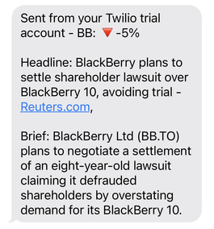

# Stock Trading News Alert
Be alerted to fluctuations of price in your favourite stock via SMS.

## Table of Contents
* [Getting Started](#getting-started)
* [Prerequisites](#prerequisites)
* [Modules](#modules)
* [Running the Application Locally](#running-the-application-locally)
* [Usage](#usage)
* [Deployment](#deployment)

## Getting Started
This program utilises environment variables located in an .env file in the root directory. This file should contain the following lines:

````
NEWS_API=KEYHERE
ALPHA_VANTAGE=KEYHERE
TWILIO_SID=KEYHERE
TWILIO_AUTH_TOKEN=KEYHERE
PERSONAL_PHONE_NUMBER=NUMBERHERE
TWILIO_PHONE_NUMBER=NUMBERHERE
````
To change the stock that is being tracked, change the strings in stocks.py located in the /data folder in the following format:
````
STOCK_NAME = "BB"
COMPANY_NAME = "BlackBerry"
````

### Prerequisites
* [Python](https://www.python.org/downloads/)
* [News API](https://newsapi.org/)
* [Alpha Vantage](https://www.alphavantage.co/)
* [Twilio](https://www.twilio.com/)

### Modules
````
# Twilio
pip install twilio

# python-dotenv
pip install python-dotenv

# Requests
pip install requests

# schedule
pip install schedule
````

### Running the Application Locally
````
# Run the program.
python main.py
````

## Usage
The program runs once a day, every weekday at US market open (converted to UK time) - gathering information about the stock closing price from the previous day and the day  before yesterday. If the stock has fluctuated in price by at least 2% then an SMS message is sent to your phone with an alert and some news regarding the stock.



## Deployment
If you are hosting externally then specify all environment variables on the external platform. You should never upload a private token directly to GitHub or a third-party host.

````
# Start command when hosted by a third-party.
python main.py
````
